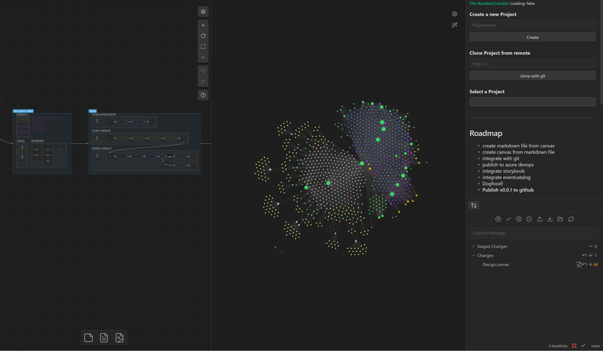

# 🎃The Numbercruncher

#experimental #proofofconcept #poc

An Obsidian Plugin, supporting the product development & management process e2e. 
Establishing a unified content repository for product teams.

---

---

## Early alpha

- breaking changes will hapen on a weekly basis
- not recommended for production

---

## Feedback

For any issues, bugs or feedback, please use the following links:

- Issue Tracker: https://github.com/Luis85/numbercruncher/issues
- Discussions: https://github.com/Luis85/numbercruncher/discussions

---

## Roadmap

- [ ] Build for production
- [ ] Integrate with Azure DevOps Boards
- [ ] Integrate with Git
- [ ] Integrate with Jira
- [ ] Integrate with Mural
- [ ] Integrate with EventCatalog
- [ ] Integrate with StoryBook
- [ ] **Release v0.0.1 - MvP**
- [ ] Maybe time for tests
- [ ] Define contribution & publishing processes
- [ ] Publish Codebase for Contributions
- [ ] Compliance with Obsidian Plugin conventions
- [ ] Publish on Obsidian Marketplace

---

## Features

- [ ] Requirements Engineering Essentials
- [ ] Project Management Essentials
- [ ] Integrates well with the M365 eco-system

--- 

## Getting started

- @TODO

---

## Status Quo

---

## Development Process

- trying to follow a lean and agile development process

---

### Discovery

Discovering improved solutions based on the provided feedback

---

### Refinement

Scope of the next release

---

### Planning

Plan for the next increment

---

### Development

- Plugin Update via git