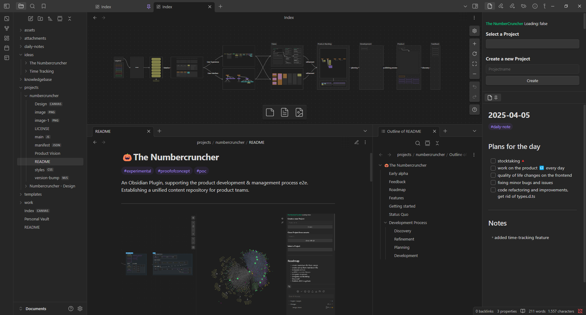

## 🎃The Numbercruncher

Ideate, Design, Validate, Develop, Evaluate, and Document in **one place** as **one team**

---
## One place - One team

Organize and tackle the **daily business** together

---

## 🎯Goals of this project

- provide best in class **project management** tools
- provide best in class **product management** tools
- provide an easy to use **ISO compliant QMS**
- provide an easy to use **ISO compliant ITSMS**
- provide an easy to use, fully integrated, **knowledge repository**
- connect and document **business processes e2e**

---

## The MvP

Connect your data.
**Build**, test, and document **Solutions**.

---
## Target Audience

- Project manager
- Product manager
- Product teams

---
## Key Features & Capabilities

- Project Management Essentials
- Product Management Essentials

---
## Value Proposition

By connecting the workspaces of all involved parties during product development, the Numbercruncher reduces friction between processes, provides common knowledge and enables product teams to share a common goal, best-practices, and speak the same language across the board.

---
## Success Metrics

- Monthly Average GitHub Stars
- Monthly Average GitHub Issues
- Monthly Average GitHub Pull Requests
- Monthly Average GitHub Discussions
- Monthly Average GitHub Views
- Monthly Average Downloads

---

**The Numbercruncher**
a Quality Management System at it's core

---
## 🎃Get the standalone plugin

[The Numbercruncher](https://github.com/Luis85/numbercruncher)

---
## Learn more

- [[README]]
