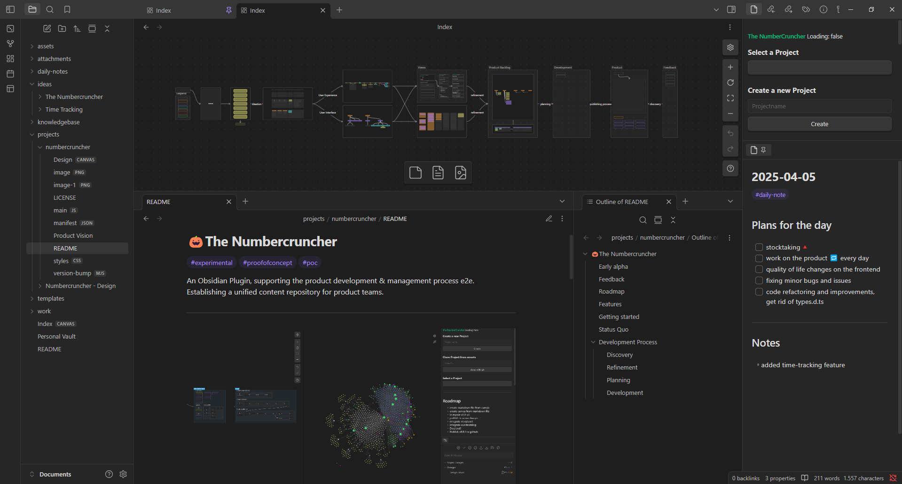
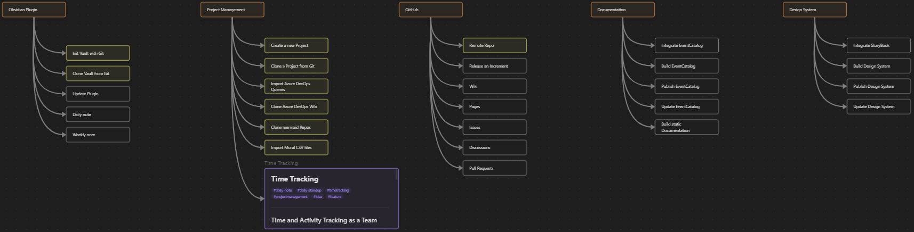
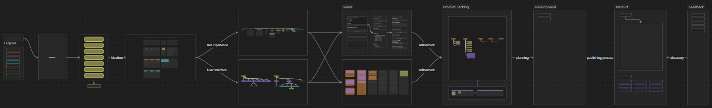

# 🎃The Numbercruncher

#experimental #proofofconcept #poc

An Obsidian Plugin, supporting the product development & management process e2e. 
Establishing an unified content repository for product teams.

---

---
## Early alpha

- breaking changes will happen on a weekly basis
- not recommended for production

---
## Feedback

For any issues, bugs or feedback, please use the following links:

- Issue Tracker: https://github.com/Luis85/numbercruncher/issues
- Discussions: https://github.com/Luis85/numbercruncher/discussions

---
## Roadmap

- [ ] Build for production
- [ ] Integrate with Azure DevOps Boards
- [ ] Integrate with Git
- [ ] Integrate with Jira
- [ ] Integrate with Mural
- [ ] Integrate with EventCatalog
- [ ] Integrate with StoryBook
- [ ] Maybe time for tests
- [ ] **Release v0.0.1 - MvP**
- [ ] Define contribution & publishing processes
- [ ] Publish Codebase for Contributions
- [ ] Compliance with Obsidian Plugin conventions
- [ ] Publish on Obsidian Marketplace

---
## Features

- [ ] Requirements Engineering Essentials
- [ ] Project Management Essentials
- [ ] Integrates well with the M365 eco-system

--- 
## Getting started

1. Get and install Obsidian from [obsidian.md](https://obsidian.md/)
2. Get and install Git from [git-scm.com](https://git-scm.com/)
3. Download the Skeleton by clicking "code" and "download as zip"
4. Extract the zip into an empty folder
5. Open the folder with Obsidian
6. Initialize your Place and start building

---
## Product Backlog

---
## Development Process

Trying to follow a lean and agile development process

---
### Discovery

Discovering improved solutions based on the provided feedback

---
### Refinement

Scope of the next release which needs to be refined before development

---
### Planning

Plan for the next increment

---
### Development

- [ ] Plugin Update via git